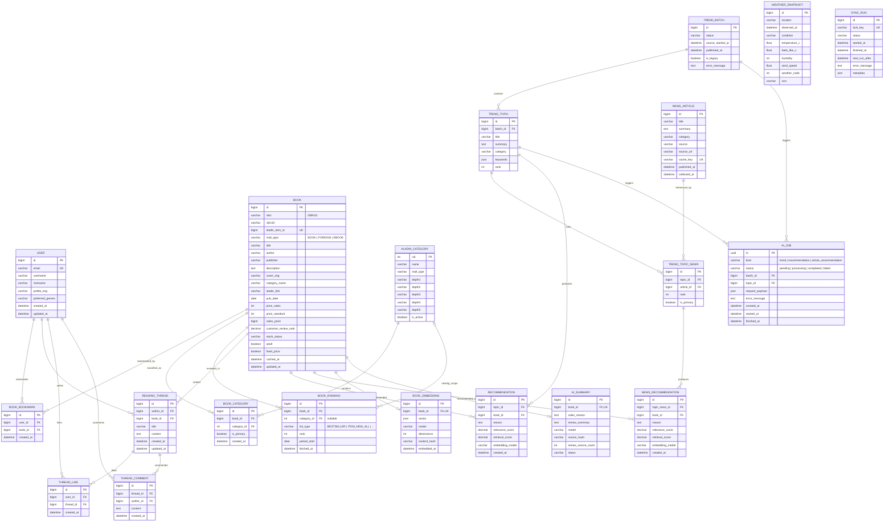

# TrendBook ERD

알라딘의 국내도서(`BOOK`), 외국도서(`FOREIGN`), 전자책(`EBOOK`)을 공통 도서 구조로 관리한다. 카테고리 CID는 몰 전체에서 고유하며, 하나의 도서는 여러 카테고리에 속할 수 있다.

## 무결성 규칙

- `Book.isbn`은 ISBN13을 우선 저장하고 고유하게 관리한다.
- `AladinCategory.cid`는 CSV의 CID를 그대로 기본키로 사용한다.
- `BookCategory(book, category)` 조합은 중복될 수 없다.
- 한 도서에는 `is_primary=true`인 대표 카테고리를 최대 하나만 둔다.
- 동일 도서·리스트 유형·집계일·카테고리 범위의 순위는 하나만 저장한다.
- 카테고리 CSV에 부모 CID가 없으므로 임의의 자기참조 FK를 만들지 않고 `depth1`~`depth5` 원형을 보존한다.
